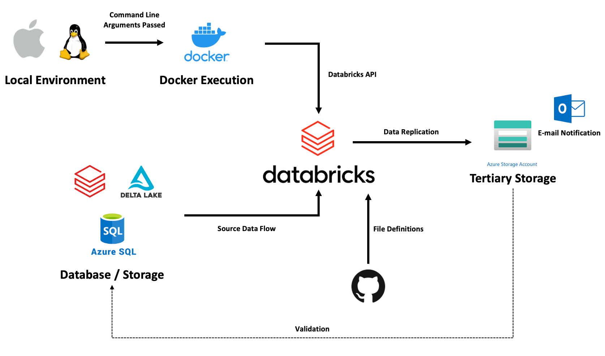

# Data Lineage & Replication Management Project on Azure Databricks

2023.08 

## Overview
Mini-project on data replication/lineage and metadata management using Azure Databricks.

Aim was to simulate seamless data replication processes accross different business organizations and environments, 
with data consistency, operational performance and scalability in mind.

## Business Problem
> External team requires replicated sets of select data without compromising existing data lineage and validity

## Scenario Flow 
1. From a containerized environment, an API request is made for Databricks to replicate data to external containers
2. Data replication is conducted using Databricks as the controlling agent across source data and replications
3. Replicated data is tested and validated
4. Once request is processed and job complete, email notification is sent

## Technologies
- **Languages:** Python, SQL 
- **Frameworks:** Pyspark
- **Services:** Databricks, Azure(Storage Account, SQLServer, Logic Apps), GitHub

## Data Used
Utilized a simple `.csv` dataset from Kaggle on Insurance Company Complaints
- Due to the source data, some engineering was involved to allow for Delta formatting
- Utilized this data set to ingest into Databricks, manage in storage, and replicate to a separate storage account

[Link to Source Data](https://www.kaggle.com/datasets/adelanseur/insurance-company-complaints)

## Architecture

## Caveats
Using Databricks Secret-scopes to secure information is shown,
but redaction was mainly used as to make the project less heavy on using Databricks CLI

**E.O.D**
